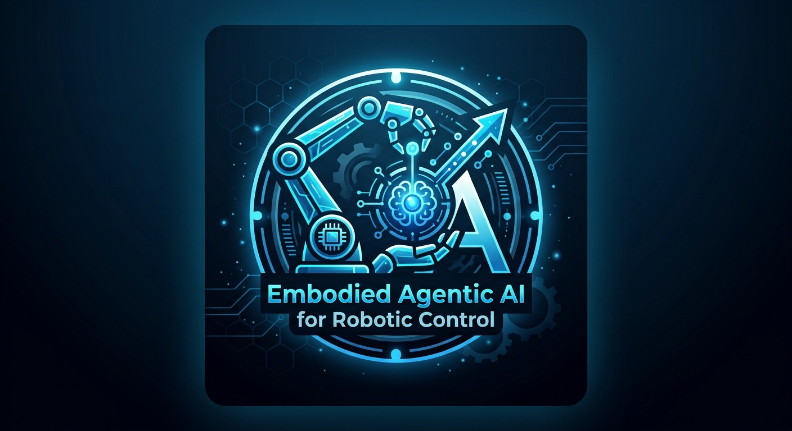

# EN.665.715 — Embodied Agentic AI for Robotic Control

**Johns Hopkins University**

This course introduces the principles of large language models, agentic reasoning, and robotic sensor-actuator systems within the context of embodied AI. Students apply this knowledge to design, build, and evaluate AI agents that convert natural language intent into autonomous robot control on a physical robotic car platform. The curriculum emphasizes hands-on integration of ROS 2, modern agentic frameworks, Gazebo simulation, and locally deployed LLMs. Students conduct rigorous empirical evaluations using statistical methods to measure agent effectiveness. The course culminates in a class project demonstrating a complete, working embodied AI system.

## Modules

| Module | Topic | Description |
|--------|-------|-------------|
| [Module 2](module-2-ollama-ros2-rosa/) | Ollama Models & ROS 2 & ROSA Tool Setup | Set up Ollama LLMs, ROS 2 (Docker), and ROSA for natural language robot control |
| [Module 4](module-4-agent-architecture-mcp/) | Agent Architecture, MCP & Pico 2 W | Extend ROSA with MCP tools and control a Pico 2 W over micro-ROS |

## Getting Started

1. Clone this repository
2. Run Docker Compose commands from this repository root
3. Follow the README in each module folder for its Python commands

## Prerequisites

- macOS, Linux, or Windows
- [Git](https://git-scm.com/)
- [Docker Desktop](https://www.docker.com/products/docker-desktop/)
- [Ollama](https://ollama.com)
- Python 3.12+
